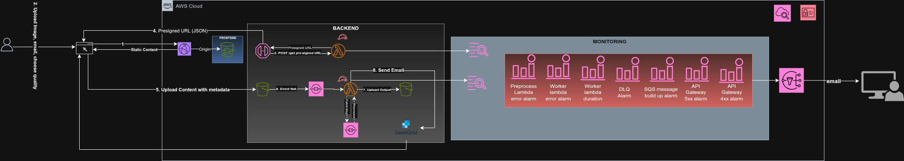

# AWS Serverless Image Compressor

An event-driven serverless application for automatic image compression with email delivery, built on AWS using Infrastructure as Code (Terraform).

## 🏗️ Architecture



## 🚀 Features

- **Serverless Architecture**: Zero server management, auto-scaling
- **Event-Driven Processing**: Asynchronous image compression via S3 → SQS → Lambda
- **Email Delivery**: Automated email notifications with download links via SendGrid
- **Comprehensive Monitoring**: CloudWatch alarms, metrics, and dashboards
- **Infrastructure as Code**: Complete Terraform configuration for reproducibility
- **Cost-Optimized**: Pay-per-use pricing with S3 lifecycle policies

## 🛠️ Technology Stack

- **Frontend**: HTML5, CSS3, JavaScript (Vanilla)
- **Backend**: AWS Lambda (Python 3.12), API Gateway (HTTP API)
- **Storage**: Amazon S3 (3 buckets)
- **Queue**: Amazon SQS with Dead Letter Queue
- **Email**: SendGrid API
- **CDN**: CloudFront
- **Monitoring**: CloudWatch Alarms, Metrics, Dashboards
- **IaC**: Terraform
- **Image Processing**: Pillow (PIL)

## 🚦 Getting Started

### Prerequisites

- AWS CLI configured with appropriate credentials
- Terraform >= 1.0
- Python 3.12
- SendGrid account with verified sender

### Deployment
```bash
# 1. Clone the repository
git clone <https://github.com/HamzaTariq-2004/serverless-image-compressor>
cd serverless-image-compressor

# 2. Update configuration
# Edit infra/terraform.tfvars with your settings

# 3. Deploy infrastructure
cd infra
terraform init
terraform plan
terraform apply

# 4. Confirm SNS subscription
# Check your email for confirmation link

# 5. Access the application
# Use the CloudFront URL from Terraform outputs
```

## 📊 Monitoring

Access CloudWatch Dashboard: `image-compressor-dashboard`

**Alarms configured:**
- Lambda errors (Preprocess & Worker)
- Lambda duration threshold
- Dead Letter Queue messages
- SQS queue depth
- API Gateway 4xx/5xx errors

## 💰 Cost Estimation

- **Lambda**: ~$0.20 per 1M requests
- **S3**: ~$0.023 per GB
- **API Gateway**: ~$1.00 per 1M requests
- **CloudFront**: ~$0.085 per GB (first 10TB)
- **Estimated**: $0.01-0.05 per 1000 images processed

## 🔒 Security

- IAM least-privilege policies
- S3 server-side encryption (AES256)
- CloudFront with Origin Access Control
- Presigned URLs for temporary upload access
- No hardcoded credentials

## 📝 License

MIT License

## 👤 Author

Hamza Tariq
- GitHub: [@HamzaTariq-2004]
- LinkedIn: [https://www.linkedin.com/in/hamza-tariq-73b744274/]

## 🙏 Acknowledgments

Built as a learning project for AWS serverless architecture and DevOps practices.